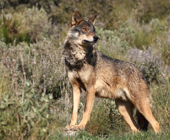
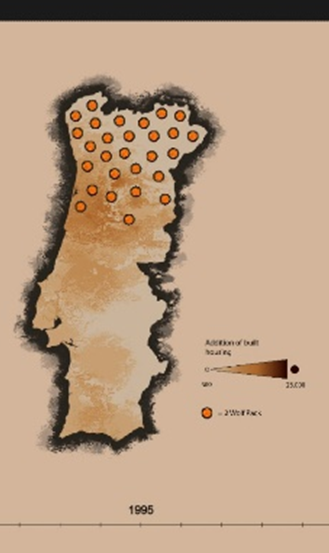
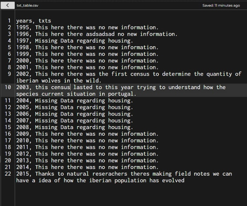
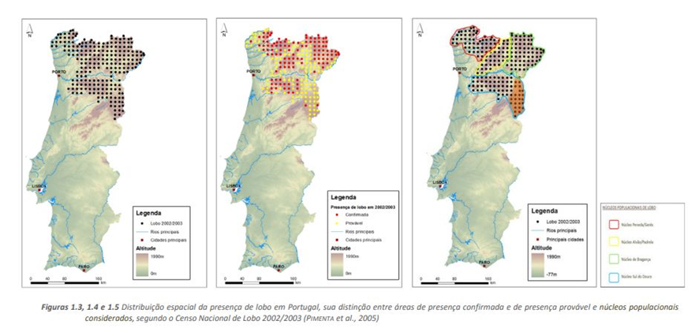
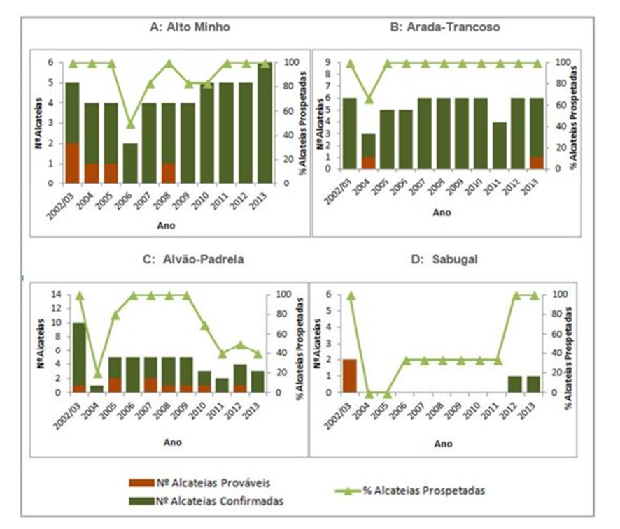

###   **iberianwolfpt**

**Group name:** 
Iberian Wolf PT

**Members:**
Alexandra Esteves (3200423), Catarina Geraldes (3200706), José Barosa (3200340) e Kateryna Oleshchenko (3210979).

Our project for the curricular unit of "Project Lab" was aimed to provoke a reaction and reflection to the visitor, presenting through a map with interactive slider where you can see the evolution of the Iberian wolf packs (_canis lupos signatus_) and the visual representation of the amount of the new buildings that were built throughout the years - having as a final element the representation of how many of those new buildings are currently abandoned in the last year of study. The idea we tried to get across is that over the years we have been building more and more buildings, pushing and limiting the Iberian wolf, which has almost become extinct due to human activity, and then we end up abandoning what we built.

The interactive map will be composed of two layers of information: the evolution of the Iberian wolf packs, the construction of new buildings in Portugal - which in the last one has the additional information of abandoned buildings; the legend and the contextualization of the selected year.

The information sources used for this project were Pordata (_pordata.pt_), Liga para a proteção da natureza (_lpn.pt_), Naturdata (_naturdata.com_), Palombar (_palombar.pt_) and Grupo Lobo (_grupolobo.pt_).

A CSV table was created within the code itself. This was used to be imported as a text array and be displayed by year as the range slider is used. The programs that helped in the execution of this project were p5*js; Paint Tool Sai; Adobe Illustrator; Adobe Photoshop.

-The following data was used to get the wolf pack data:

Fontes de recolha:
https://www.pordata.pt/municipios/edificios+licenciados+para+habitacao+familiar+total+e+por+tipo+de+obra-107
https://www.pordata.pt/municipios/edificios+concluidos+para+habitacao+familiar+total+e+por+tipo+de+obra-102
https://www.icnf.pt/api/file/doc/4f9c051e0e8f2808
https://www.grupolobo.pt/lobo-iberico
http://www.palombar.pt/pt/noticias/o-censo-do-lobo-como-ele-e-2022-05-27/

**Trabalho Realizado para a discimplina de Laboratórtio de projeto I:
Professor Marco Heleno
1ºSemestre Licenciatura de Design gráfico e multimédia
Esad CR
